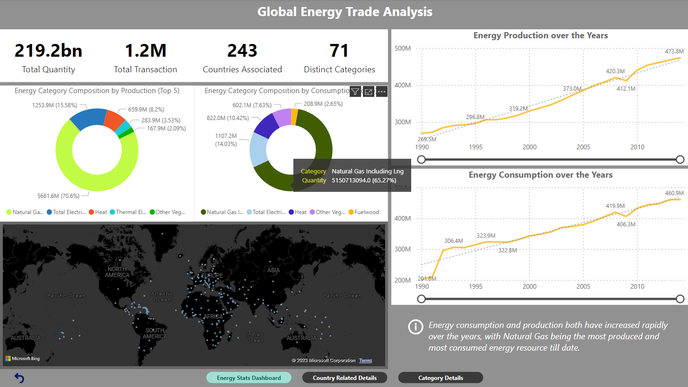
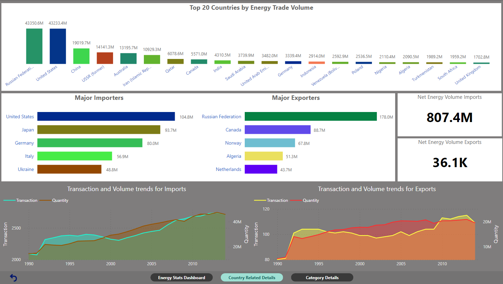
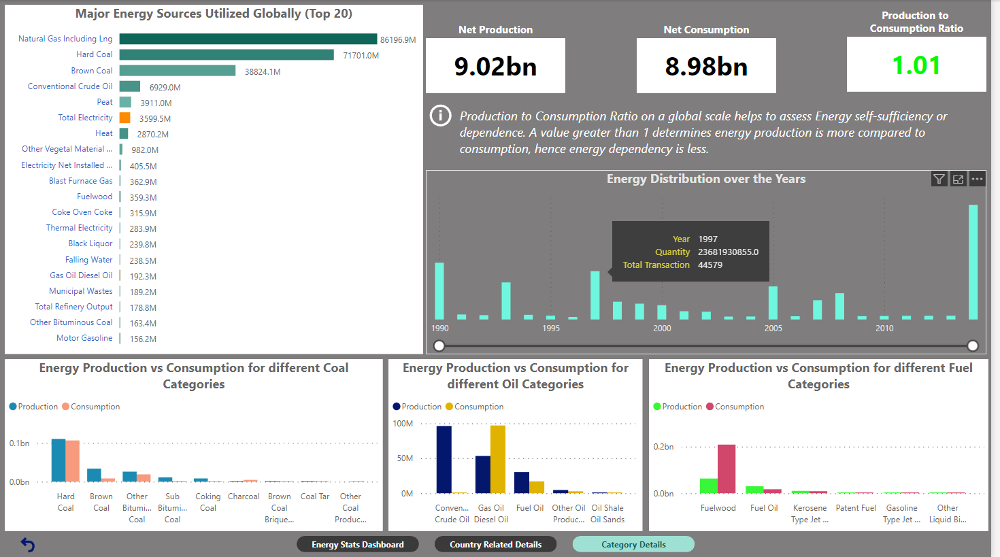

# Global Energy Trade Analysis PowerBI Report

This repository contains a Power BI report that focuses on Global Energy Trade Analysis. The report provides comprehensive insights into energy production, consumption, and trade on a global scale. By exploring key business queries, we uncover valuable trends and patterns in the energy industry. Let's dive into the details:

## Business Queries Addressed

### 1. How has global energy production changed over time?
The report analyzes historical data to identify trends and patterns in global energy production. Through interactive visualizations, it reveals the changes in production volumes and highlights significant shifts over time.

### 2. Which countries have the highest energy production?
By leveraging the power of Power BI, the report identifies the countries that lead in energy production. It provides a clear overview of the top countries with the highest energy production volumes, enabling a deeper understanding of global energy dynamics.

### 3. What are the major energy sources utilized globally?
Through comprehensive data analysis, the report examines the major energy sources utilized globally. It delves into the distribution of energy sources and reveals how their usage has changed over the years. These insights are crucial for understanding the energy mix and identifying trends towards more sustainable sources.

### 4. How does energy consumption vary across different regions or continents?
The report offers a comprehensive analysis of energy consumption across various regions and continents. By visualizing consumption patterns, it highlights variations and identifies regions that stand out in terms of energy demand. These insights provide valuable guidance for tailored energy strategies and market targeting.

### 5. Analyze the energy import and export patterns for different countries.
The report investigates energy import and export patterns, shedding light on the largest importers and exporters of energy. Through interactive visualizations, it enables users to analyze trade dynamics and understand the flow of energy resources globally.

### 6. Compare the Production and Consumption volume for different energy categories.
By comparing production and consumption volumes across different energy categories, the report provides insights into supply-demand dynamics. This analysis identifies areas where production falls short or exceeds consumption, facilitating decision-making and resource optimization.

## Getting Started

To explore the Global Energy Trade Analysis Power BI report, follow these steps:

1. <B>Clone the Repository:</B> Clone this repository to your local machine using git clone https://github.com/your-username/repository.git.

2. <b>Install Power BI Desktop:</b> Ensure you have Power BI Desktop installed on your computer. If not, download it from the official Microsoft website.

3. <b>Dataset</b> : Extract the dataset present in archive.zip 

3. Open the Report: Launch Power BI Desktop and open the Global Energy Trade Analysis Report.pbix file located in the repository.
   
  <b><i>Note: </b></i> If visuals are not loading and showing some error, click on Transform data under Home tab. In the right pane, click on the gear icon beside 'Source'. Change the path of the dataset to the path where it is present in your pc. Hit Apply and Close button on top left corner. 

5. <b>Interact with the Report:</b> Once the report is open, you can interact with the visualizations, apply filters, and explore the data based on the business queries mentioned above.

## Screenshots

# Global-Energy-Trends
